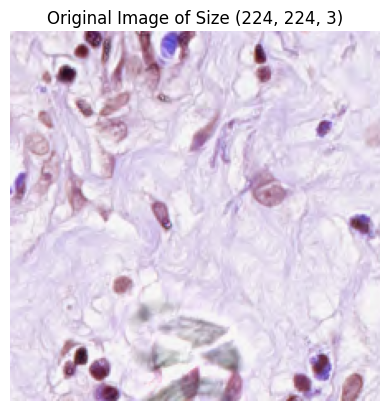
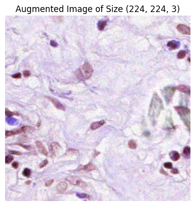
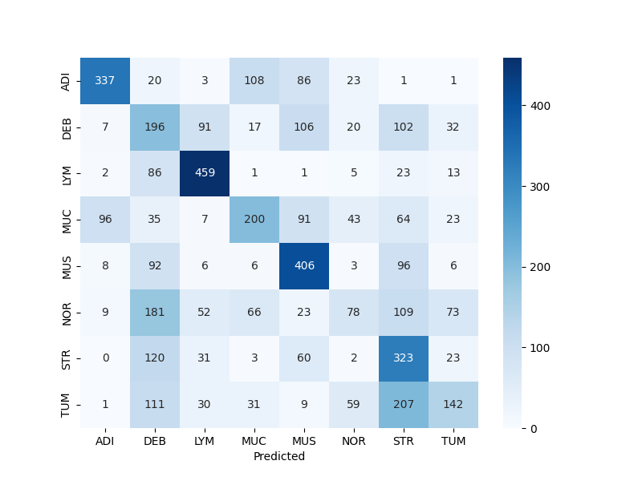
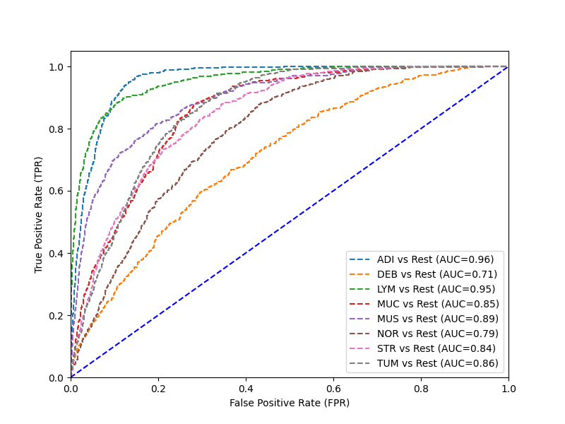

### Enhancing Histopathology Classification Using Channel + Spatial Attention Modules 

A implementation of a cheap covolutional neural network with convolutional block attention modules (CBAM) and squeeze and excite blocks (SE). Histopathology data sets are inheriently difficult to classify due to the complexity of the images that capture cellular differences in the tissue. Neural networks that have performed well on these types of data sets are often computationally expensive and involve millions-billions of parameters. CBAM and SE blocks alongside data augmentation techniques have been shown to be very effective in boosting classification accuracy across all classes.

<p align="center">
  
  
</p>

<p align="center">
  
  
</p>

_Example images used in data-augmentation, as well as performance of the baseline architecture + CBAM_

---
PyTorch Installation:
- Instructions to install PyTorch [here](https://pytorch.org/get-started/locally/)
---
To get started:
- Do  ```git clone https://github.com/luoj21/histopathology_classification.git```
- Create a virtual environment: ```python3 -m venv .venv```
- Install dependencies: ```pip install -r requirements.txt```
- Get the ```HNU-GC-HE-30K``` data set, which can be found [here](https://www.kaggle.com/code/mdismielhossenabir/gastric-cancer-histopathology-tissue)
    - The data set should go into the ```data``` folder, preferably under the path ```...\histopathology_classification\data\HMU-GC-HE-30K\all_image```
- Change the ```config.json``` file to your liking
- If you want to add/remove blocks to the network, change the architecture under ```src\nnet\torchBaselineModel.py```
- Run ```main.py``` 
---

Some references:
- [CoAtNeXt:An Attention-Enhanced ConvNeXtV2-Transformer Hybrid Model for Gastric Tissue Classification](https://arxiv.org/abs/2509.09242)
- [CViTS-Net: A CNN-ViT Network With Skip Connections for Histopathology Image Classification](https://ieeexplore.ieee.org/document/10643450)
- [Squeeze-and-Excitation Networks](https://arxiv.org/abs/1709.01507)
- [CBAM: Convolutional Block Attention Module](https://arxiv.org/abs/1807.06521)

---